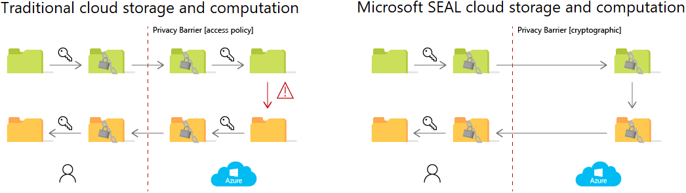
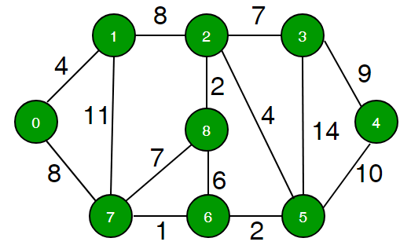
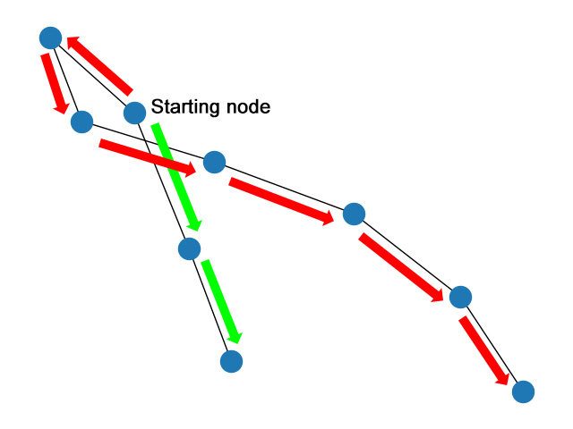

# Presentation Video Link: 
https://youtu.be/z2oZsGcWIl8

Fully Homomorphic Encryption (FHE) scheme is a method where calculations
are done on the encrypted data without needing to decrypt. Calculated
values are also encrypted. FHE enables the information owner (client) to
have full privacy while benefiting remote(ex. cloud) calculations. In
this report is about the term project focused on adapting a common
conventional network problem \"Find if there is a path of more than k
length from a source\" and its solution into a Fully Homomorphic
Encryption (FHE) network.

# Introduction

The problem with today's technology is the poor privacy. Smartphones and
a lot of smart devices are online nowadays and they constantly broadcast
private and personal information to their servers for the \"service\".
Those services usually where your data needed to be synced with other
devices or computation for a outcome.

Conventionally those computations needs the information to be decrypted
before the computational phase. Even if the information is encrypted on
information sender (client) side, client is obligated to share its key
with the server to be able to decrypt computational data.

Fully Homomorphic Encryption (FHE) is developed to change this workflow
with a fully-encrypted one (Figure
[1](#fig:seal_network_workflow){reference-type="ref"
reference="fig:seal_network_workflow"}).

{#fig:seal_network_workflow
width="12cm"}

[@SEAL] []{#fig:seal_network_workflow label="fig:seal_network_workflow"}

While improving privacy and security features, one must compromise on
other features. In this case, SEAL compromised on operation features.
One can only add, subtract, multiply, negate, shift right/left with the
given encrypted values.

Limitations in operations comes with the real-world adaption challenges.
Cloud computation developer needs to use only those basic operations to
achieve the results.

In this project report, Section 2 will provide background information
needed for the work done. Section 3 includes contributions done in this
project to the given subject. Section 4 is where the project results and
discussions will be presented. Conclusion of the project and future work
will be found in Section 5.

## Real Life Use Case

An example might be given for better understanding the reason for
developers embrace such challenges to adapt the FHE to currently working
systems.

For a real-case example scenario we might use the example \"A medical
researcher wants to compute descriptive statistics on a population of
lung cancer patients at a hospital.\" given in an article at website
inpher.io[@FHE_usage_example]

In this scenario the hospital is unable to share its private medical
records with the researcher due to the HIPAA privacy rule. Normally, end
of the research. However, with FHE technology, the hospital encrypts its
sensitive data using a fully homomorphic encryption scheme, so that the
data is protected while also able to be computed on.

What the researcher do is he encrypts the patient dataset and sends the
data on the cloud computing servers without a key. The server only sees
encrypted data and still it is able to conduct analytical computations
for the researcher and the server sends back the results back to the
researcher, also encrypted. Only the researcher is able to decrpyt and
observe the results as he is the only key-holder. The Figure
[2](#fig:seal_network_figure){reference-type="ref"
reference="fig:seal_network_figure"} displays a similar scenario data
workflow.

{#fig:seal_network_figure
width="12cm"}

[@FHE_flow] []{#fig:seal_network_figure label="fig:seal_network_figure"}

# Background Information

## Homomorphic Encryption

Companies often send, receive, and store their cloud data in encrypted
form. But to take advantage of cloud computing, companies must provide
either unencrypted data or the keys to decrypt it. This practice puts
company data at increased risk. Homomorphic encryption allows
computation directly on encrypted data, making it easier to apply the
potential of the cloud for privacy-critical data.

Traditional encryption schemes consist of three functionalities: key
generation, encryption, and decryption. Symmetric-key encryption schemes
use the same secret key for both encryption and decryption. It enables
efficient encryption of large amounts of data for secure, outsourced
cloud storage. Public-key encryption schemes use a public key for
encryption and a separate, secret key for decryption. Anyone who knows
the public key can encrypt data, but only someone who knows the secret
key can decrypt and read the data. Public-key encryption enables secure
online communication, but is typically less efficient than symmetric-key
encryption.

You can use traditional encryption for secure storage and communication,
but outsourced computation has required the removal of encryption
layers. Cloud services that provide outsourced computation must
implement access policies to prevent unauthorized access to the data and
keys. Data privacy relies on the access control policies that are
imposed by the cloud provider and trusted by the customer.

## SEAL

With SEAL homomorphic encryption, cloud providers never have unencrypted
access to the data they store and compute on. Computations can be
performed directly on encrypted data. The results of such encrypted
computations remain encrypted, and can be decrypted only by the data
owner by using the secret key. Most homomorphic encryption uses
public-key encryption schemes, although the public-key functionality may
not always be needed. [@SEAL]

## EVA

EVA is a compiler for homomorphic encryption, that automates away the
parts that require cryptographic expertise. This gives you a simple way
to write programs that operate on encrypted data without having access
to the secret key.

Think of EVA as the \"C compiler\" of the homomorphic world. Homomorphic
computations written in EVA IR (Encrypted Vector Arithmetic Intermediate
Representation) get compiled to the \"assembly\" of the homomorphic
encryption library API. Just like C compilers free you from tricky tasks
like register allocation, EVA frees you from encryption parameter
selection, rescaling insertion, relinearization. [@EVA]

## The Problem and The Conventional Solution to It

## The problem

Finding if there is a path of more than k length from a source (node)

Brief explanation: Given a graph, a source node in the graph and a
number k, find if there is a simple path (without any cycle) starting
from given source and ending at any other node.

One important thing to note is, simply doing BFS or DFS and picking the
longest edge at every step would not work. The reason is, a shorter edge
can produce longer path due to higher weight edges connected through it.

For example:

{#fig:example_network
width="12cm"}

[@tutorialspoint] []{#fig:example_network label="fig:example_network"}

## The Conventional Solution with Python

The idea is to use Backtracking. We start from given source, explore all
paths from current node. We keep track of current summation of distance
from source. If distance becomes more than k, we return true in order to
use a more efficient algorithm. If a path does not produces more than k
distance, we backtrack and proceed another branch.

How does one can be sure that the path is simple and do not loop in a
cycle? The solution is to keep track of current path vertices in an
array. Whenever we add a vertex to path, we check if it already exists
or not in current path. If it exists, we ignore the edge.\

Example solution code using python can be given as shared by
[@tutorialspoint]

``` {.python language="Python"}

# Program to find if there is a simple path with  
# weight more than k  
    
# This class represents a dipathted graph using  
# adjacency list representation  
class Graph: 
    # Allocates memory for adjacency list  
    def __init__(self, V): 
        self.V = V  
        self.adj = [[] for i in range(V)] 
    
    # Returns true if graph has path more than k length  
    def pathMoreThanK(self,src, k): 
        # Create a path array with nothing included  
        # in path  
        path = [False]*self.V  
        
        # Add source vertex to path  
        path[src] = 1 
        
        return self.pathMoreThanKUtil(src, k, path) 
        
    # Prints shortest paths from src to all other vertices  
    def pathMoreThanKUtil(self,src, k, path): 
        # If k is 0 or negative, return true  
        if (k <= 0):  
            return True 
        
        # Get all adjacent vertices of source vertex src and  
        # recursively explore all paths from src. 
        i = 0
        while i != len(self.adj[src]): 
            # Get adjacent vertex and weight of edge  
            v = self.adj[src][i][0] 
            w = self.adj[src][i][1] 
            i += 1
        
            # If vertex v is already there in path, then  
            # there is a cycle (we ignore this edge)  
            if (path[v] == True):  
                continue 
        
            # If weight of is more than k, return true  
            if (w >= k): 
                return True 
        
            # Else add this vertex to path  
            path[v] = True 
        
            # If this adjacent can provide a path longer  
            # than k, return true.  
            if (self.pathMoreThanKUtil(v, k-w, path)):  
                return True 
        
            # Backtrack  
            path[v] = False
        
        # If no adjacent could produce longer path, return  
        # false  
        return False 
       
    # Utility function to an edge (u, v) of weight w  
    def addEdge(self,u, v, w): 
        self.adj[u].append([v, w])  
        self.adj[v].append([u, w]) 
    
# Driver program to test methods of graph class  
if __name__ == '__main__': 
   
    # create the graph given in above fugure  
    V = 9 
    g = Graph(V)  
    
    #  making above shown graph  
    g.addEdge(0, 1, 4)  
    g.addEdge(0, 7, 8)  
    g.addEdge(1, 2, 8)  
    g.addEdge(1, 7, 11)  
    g.addEdge(2, 3, 7)  
    g.addEdge(2, 8, 2)  
    g.addEdge(2, 5, 4)  
    g.addEdge(3, 4, 9)  
    g.addEdge(3, 5, 14)  
    g.addEdge(4, 5, 10)  
    g.addEdge(5, 6, 2)  
    g.addEdge(6, 7, 1)  
    g.addEdge(6, 8, 6)  
    g.addEdge(7, 8, 7)  
    
    src = 0 
    k = 62 
    if g.pathMoreThanK(src, k): 
        print("Yes") 
    else: 
        print("No")  
    
    k = 60 
    if g.pathMoreThanK(src, k): 
        print("Yes")  
    else: 
        print("No") 
```

# Main Contributions

## Trying to Implement the Known Algorithm

First of all, the example network and algorithm as given in
\"tutorialspoint.dev [@tutorialspoint]\" tried to be implemented in FHE
scheme for the project.

After many tries, it was concluded that an algorithm that calculates
longest path on a given cyclic network graph with only simple arithmetic
operations and vectors were not easy enough to be implemented in EVA in
project time.

## Implementation of FHE friendly algorithm

In order to solve the problem in a FHE network, a non-cyclic graph
decided to be used in this project.

Our code generates series of nodes connected to each other with randomly
generated path (edge) weight.

``` {.python language="Python"}
def generateGraph(n):
    ws = nx.path_graph(n)
    return ws
```


\
Then this graph is converted to a python dictionary with the key format
of 'p' = pathWeight in order to be able to feed into EVA program.

``` {.python language="Python"}
def serializeGraphZeroOne(GG,vec_size):
    n = GG.size()
    print("n:",n)
    graphdict = {}
    g = []
    for nodeindex in range(n):
    
        weight = randrange(1,10)
        
        g.append(weight)  
        key = 'p_' + str(nodeindex)+ '_' + str(nodeindex+1)
        graphdict[key] = [weight,0] # EVA requires str:listoffloat
    # EVA vector size has to be large, if the vector representation of the graph is smaller, fill the eva vector with zeros
    for i in range(vec_size - n): 
        g.append(0.0)
    print(len(g))
    return g, graphdict
```

An example output dictionary result:

``` {.python language="Python"}
graphdict: {'p_0_1': [4, 0], 'p_1_2': [5, 0], 'p_2_3': [4, 0], 'p_3_4': [6, 0], 'p_4_5': [4, 0], 'p_5_6': [9, 0], 'p_6_7': [2, 0], 'p_7_8': [2, 0]}
```

Notice there is a 0 appended on each path weight vector because EVA
needs the input vector size to be power of 2. So a dummy 0 is added.

Then the built input dictionary fed to EVAProgramDriver:

``` {.python language="Python"}
grap_find_max_path_length = EvaProgramDriver("grap_find_max_path_length", vec_size=m,n=n)
    with grap_find_max_path_length:
        input = {'zero': Input('zero', is_encrypted=True)}
        for i in range(n):
            key = f"p_{i}_{i+1}"
            input[key] = Input(key)
        path_sum_left,path_sum_right = pathsumprogram(input, n ,start_node_index)
        Output('path_sum_left', path_sum_left)
        Output('path_sum_right', path_sum_right)
```

Using the given keys of EVA inputs, a function makes the summation to
both direction of starting node index.

``` {.python language="Python"}
def pathsumprogram(path,nodecount,start_node_index):
    matrix = np.zeros(shape=(1,2), dtype=Expr)
    sum_left = 0
    sum_right = 0
    print(range(start_node_index,nodecount,1))
    print(range(0,start_node_index,1))

    for path_index in range(start_node_index,nodecount-1,1):
        sum_right += path[f"p_{path_index}_{path_index+1}"]
    for path_index in range(0,start_node_index-1,1):
        sum_left += path[f"p_{path_index}_{path_index+1}"]
    return sum_left,sum_right
```

To visualize an example, lets say the starting node is 2. In Figure
[5](#fig:project_network_path){reference-type="ref"
reference="fig:project_network_path"} it can be seen the function's path
while doing summation.

{#fig:project_network_path
width="12cm"}

After the results are decrypted by the client, client-side can see if
either path length is longer than the given length k or not.

# Results and Discussion

## Methodology

In this project a rather simple implementation was chosen because of the
complexity of the other network types.

Therefore the methodology is also straightforward.

**Client side:** There is a generated network with number n nodes and
each has maximum of 1 paths to others. This network is generated by
networkx library on python.

This network was vectorized and put in a python dictionary format with
the connecting node's indexes and the weight of the connecting path.

Afterwards this vector was fed to EVA.

EVA encrypted the given vector and used the encrypted version to
calculate both left hand side and right hand side total path length.

After the outputs generation, there is an observable calculation error
caused by doing the encrypted operations and conversions. In the result,
those errors will be addressed.

## Results

After 1000 tries, method seems to be consistently able to calculate the
correct results every time with similar amounts of error.

For a randomly picked results of one of the runs, Paths on the left hand
side was calculated as 4.00000000144591 in the FHE method, without FHE
the result was 4.0, this means $\%3.6e-8$ error. Paths on the right hand
side was calculated as 26.999999998706993 instead of 27.0 which yields
$\%4.8e-11$ error.

Averages for 9 nodes input can be given as:

  -------------------------- ----------
  compile time (ms)          1.41
  key generation time        20.93
  encryption time            48.01
  execution time             10.91
  decryption time            6.52
  reference execution time   0.14
  mean square error          9.43e-19
  -------------------------- ----------

  : Average Time and Error

## Discussion

Although this implementation works as intended on non-cycle networks,
FHE network using EVA was not capable of solving networks with cycle
paths in ease. It can be a result of lack of knowledge or limited time
for this project. However, it was fairly easy to implement as done on
the project.

Another issue needs to be addressed is that execution times are high
enough to hinder calculations for networks with high number of nodes.
This was expected as it was a known downside of FHE networks from the
start. However, promisingly FHE improves by both performance and
capability every day and getting ready to be used in wider scenarios.

Finally, calculation errors caused by the conversions and
encryption/decryption were so low for this project that they could be
neglected as rounding them to the nearest integer.

# Conclusion

In this term project, an implementation of FHE into a known network
problem \"Finding if there is a path of more than k length from a
source\" was done. FHE approach was applied successfully to solve the
problem for non-cycle networks using Microsoft SEAL and EVA compiler via
python. Client side generated network was converted to vector and then
python dictionary format and fed to the EVA Program. Values were
encrypted on client side and sent to server for calculations to be done
as encrypted. Left and right hand side available path length summations
were done and results were sent back to client still-encrypted. Client
was able to decrpyt and get the desired results. Further work is needed
to implement on networks with cycles.
